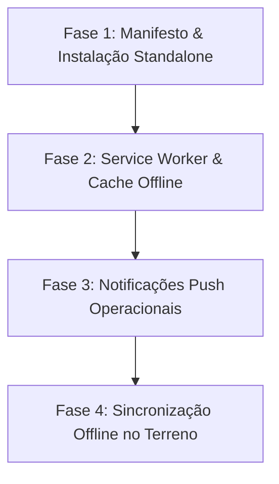

# Plano de Implementação: PWA & Notificações Push — Jardins d'Óbidos

> **Documento de Arquitetura e Roadmap**  
> **Objetivo:** Transformar a aplicação web numa **Progressive Web App (PWA)** instalável em Android e iOS, com experiência idêntica a uma app nativa, suporte a notificações push operacionais e resiliência a rede fraca no terreno.

---

## 1. Visão Geral e Benefícios para a Operação

No dia a dia da **Jardins d'Óbidos**, os jardineiros e a gerência utilizam a aplicação maioritariamente em dispositivos móveis no terreno. A transição para PWA traz três grandes vantagens operacionais:

1. **Instalação Nativa Sem Lojas de Apps:**
   - **Android:** Botão nativo *"Instalar aplicação"* no Google Chrome, criando ícone na gaveta de aplicações e ecrã inicial sem necessidade da Google Play Store.
   - **iOS:** Abertura em ecrã inteiro (*standalone*) sem barras de URL ou botões de navegação do Safari, com ecrã de arranque (*splash screen*) personalizado.
2. **Alertas e Notificações Push em Tempo Real:**
   - Envio de notificações diretamente para o telemóvel dos colaboradores (atribuição de nova manutenção, alertas de kits/materiais matinais ou alterações na rota do dia).
3. **Arranque Instantâneo e Fiabilidade:**
   - Carregamento imediato dos ficheiros da aplicação através de cache local (*Service Worker*), eliminando tempos de espera mesmo em locais com rede móvel fraca (3G/H+) nas zonas de Óbidos e arredores.

---

## 2. Fases de Implementação



---

### Fase 1: Manifesto Web & Suporte a Instalação (Sem dependências externas)
**Complexidade:** Baixa · **Impacto:** Imediato

Permite que qualquer telemóvel Android ou iPhone instale a aplicação com o logótipo oficial, nome correto e abra em ecrã inteiro.

#### Tarefas:
1. **Criação dos Ícones da App:**
   - Gerar a partir do logótipo/folha atual os formatos padrão exigidos pela W3C e Apple:
     - `public/icon-192.png` (192×192 px, formato normal)
     - `public/icon-512.png` (512×512 px, alta resolução)
     - `public/icon-maskable.png` (512×512 px com margem segura para formatos adaptativos no Android)
     - `public/apple-touch-icon.png` (180×180 px para iPhones)
2. **Criação do Ficheiro `public/manifest.webmanifest`:**
   ```json
   {
     "name": "Jardins d'Óbidos — Gestão",
     "short_name": "Jardins Óbidos",
     "description": "Sistema de gestão de manutenções e planeamento de jardins",
     "start_url": "/",
     "display": "standalone",
     "orientation": "portrait",
     "background_color": "#f4f4f3",
     "theme_color": "#1c1c1a",
     "icons": [
       {
         "src": "/icon-192.png",
         "sizes": "192x192",
         "type": "image/png"
       },
       {
         "src": "/icon-512.png",
         "sizes": "512x512",
         "type": "image/png"
       },
       {
         "src": "/icon-maskable.png",
         "sizes": "512x512",
         "type": "image/png",
         "purpose": "maskable"
       }
     ]
   }
   ```
3. **Atualização do `index.html`:**
   - Inclusão da ligação ao manifesto: `<link rel="manifest" href="/manifest.webmanifest">`.
   - Meta tags da Apple para iOS:
     - `<meta name="apple-mobile-web-app-capable" content="yes">`
     - `<meta name="apple-mobile-web-app-status-bar-style" content="default">`
     - `<meta name="apple-mobile-web-app-title" content="Jardins Óbidos">`
     - `<link rel="apple-touch-icon" href="/apple-touch-icon.png">`
   - Meta tag `theme-color` para estilizar a barra de status do telemóvel com a cor da marca.

---

### Fase 2: Service Worker & Estratégia de Cache (Vite PWA)
**Complexidade:** Média · **Ferramenta recomendada:** `vite-plugin-pwa`

Garante que o código e os recursos estáticos da aplicação são descarregados uma só vez e abrem instantaneamente.

#### Tarefas:
1. Instalar o plugin oficial do ecossistema Vite:
   ```bash
   npm install -D vite-plugin-pwa
   ```
2. Configurar o plugin em `vite.config.ts` com estratégia de atualização automática (`registerType: 'autoUpdate'`).
3. Definir regras de cache com Workbox:
   - **Assets estáticos (JS, CSS, Imagens, Fontes IBM Plex):** *Cache First* (leitura instantânea do disco).
   - **Chamadas de API Supabase:** *Network First* (busca dados frescos da BD; se não houver rede, utiliza os últimos dados em cache).
4. Componente visual discreto de notificação quando houver uma nova versão da app publicada no Netlify (*"Nova versão disponível · Atualizar"*).

---

### Fase 3: Notificações Push Operacionais (Web Push + Supabase)
**Complexidade:** Média/Alta · **Pré-requisito:** Fase 1 e 2 concluídas

Permite alertar os membros da equipa mesmo com a aplicação fechada no telemóvel.

#### 1. Modelo de Dados no Supabase:
Criar uma tabela para registar as subscrições dos dispositivos dos colaboradores:
```sql
create table if not exists notificacao_subscricao (
  id uuid primary key default gen_random_uuid(),
  colaborador_id uuid not null references colaborador(id) on delete cascade,
  endpoint text not null,
  p256dh text not null,
  auth text not null,
  criado_em timestamptz default now(),
  unique (colaborador_id, endpoint)
);

alter table notificacao_subscricao enable row level security;
create policy "colaborador gere as suas subscricoes" on notificacao_subscricao
  for all using (colaborador_id in (select id from colaborador where user_id = auth.uid()));
```

#### 2. Infraestrutura de Envio (Chaves VAPID):
- Gerar par de chaves VAPID (pública e privada). A chave pública fica no frontend para subscrever o telemóvel; a chave privada fica segura no Supabase.
- Criar uma **Supabase Edge Function** (`enviar-notificacao`) em Deno/TypeScript que recebe:
  - Destinatário (`colaborador_id`);
  - Título e mensagem;
  - Rota de destino (ex.: `/execucao/:id` ou `/planeamento`).

#### 3. Casos de Uso Automáticos:
- **Ao atribuir manutenção:** Gatilho na base de dados notifica os jardineiros da equipa selecionada.
- **Ao reagendar manutenção de hoje:** Notificação imediata para a carrinha a informar sobre a alteração de rota.
- **Lembrete diário às 17h30:** Disparado aos jardineiros que tenham trabalhos concluídos mas com itens faturáveis ou observações pendentes de registo.

---

### Fase 4: Resiliência Offline & Sincronização em Background (Posterior)
**Complexidade:** Alta · **Foco:** Zonas sem cobertura de rede

Permite que um trabalhador preencha a execução técnica e os sacos/itens gastos mesmo estando num jardim no interior sem rede.

#### Tarefas:
- Utilizar **IndexedDB** local (via biblioteca leve como `idb` ou `dexie`) para guardar submissões pendentes quando `navigator.onLine === false`.
- Utilizar a **Background Sync API** no Service Worker: assim que o telemóvel apanhar sinal de rede na estrada, o Service Worker dispara a sincronização silenciosa e envia as execuções para a base de dados do Supabase.

---

## 3. Checklist de Validação

| Critério | Método de Teste |
| :--- | :--- |
| **Manifesto Válido** | Inspecionar no Chrome DevTools (*Application → Manifest*): 0 erros de sintaxe e cores validadas. |
| **Instalação Android** | Abrir no Chrome Android em `https://...`: banner de instalação ou opção *"Instalar app"* ativa. |
| **Instalação iOS** | Abrir no Safari iOS: Partilhar → *"Adicionar ao Ecrã Principal"*. Abre sem barra de URL superior/inferior. |
| **Splash Screen** | Ícone centralizado e fundo `#f4f4f3` ao abrir a aplicação instalada a frio. |
| **Segurança HTTPS** | Certificado SSL ativo (já assegurado pelo Netlify). |

---

## 4. Próximos Passos Quando Decidires Avançar

1. **Passo 1 (Rápido, ~30 min):** Executar a **Fase 1** (gerar os ícones PNG e configurar o `manifest.webmanifest` + meta tags). A app fica imediatamente instalável no Android e iOS.
2. **Passo 2:** Testar a experiência real de navegação no telemóvel do patrão e dos jardineiros.
3. **Passo 3:** Desenvolver as notificações push conforme a necessidade da gerência.
